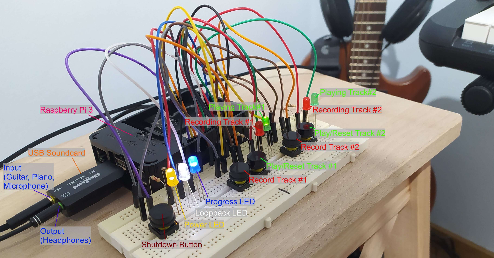
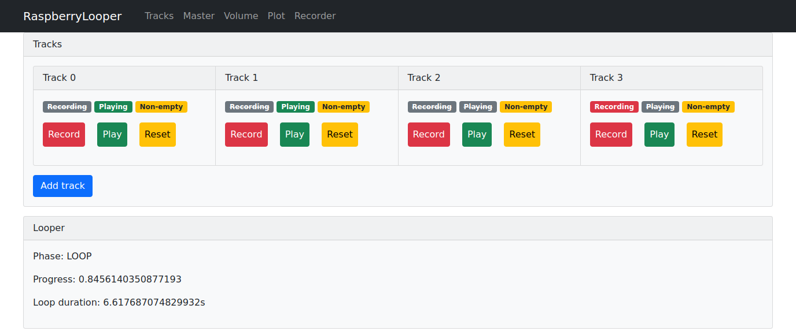
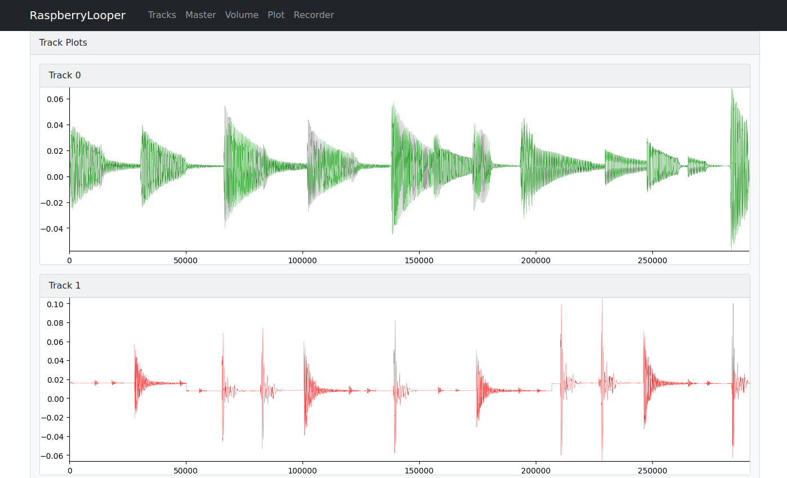
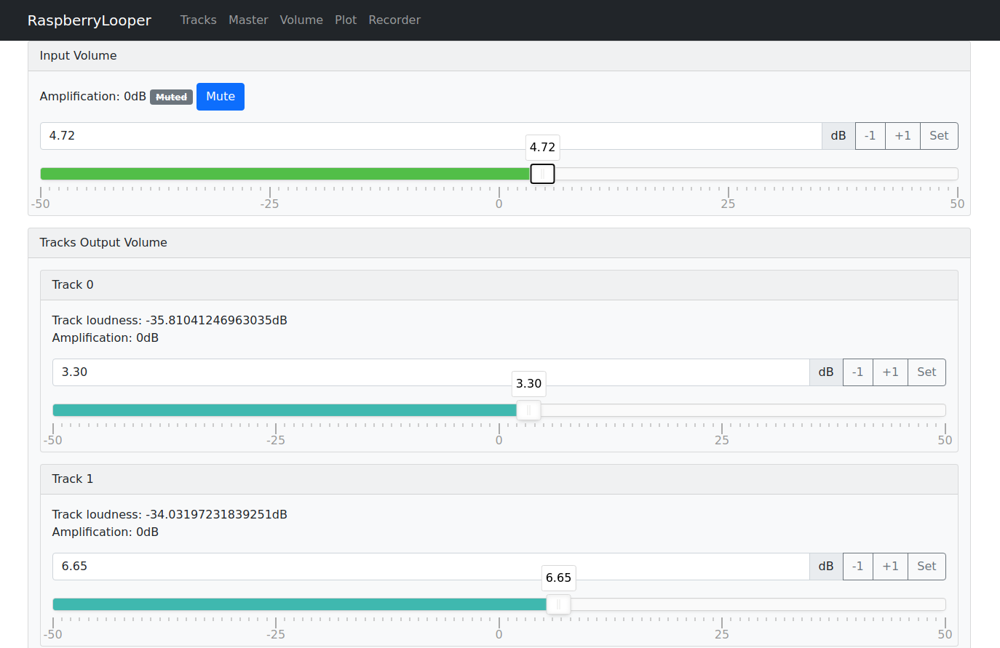

# Raspberry Looper
Audio track looper running on Raspberry Pi 
for playing multi-instrumental songs on your own.
You can record and play tracks using physical buttons and LEDs
as well as a web application through WiFi,
which provides more advanced functions.

## Features
Our chief weapons are:

- recording and playing unlimited number of tracks,
- adjusting the volume levels of the input, output and each of the tracks, 
- recording output to MP3 file and downloading it from there,
- built-in metronome,
- saving and restoring all tracks to a session file,
- controlling tracks with physical buttons and web app from a mobile phone,
- visualizing track plots,
- running on either Raspberry Pi or a regular PC with Linux,
- support for JACK low-latency audio streaming or pyAudio library,

## Examples


Web application available at http://pi:8000 in your WiFi network:







Check out [sample recording](https://raw.githubusercontent.com/igrek51/raspberry-looper/master/docs/example/list_2022-04-21_remaster.mp3)

## Setup

### Running on Raspberry Pi
You're going to need:

- Raspberry Pi 3 or other compatible board
- USB soundcard with 1 input and 1 output

On the Raspberry Pi:

1. Flash official [RaspiOS](https://www.raspberrypi.com/software/operating-systems/) `2022-04-04-raspios-bullseye-armhf.img` on SD.  
   Plug in USB soundcard with input and output.
2. Boot Raspberry, let it reboot (expand filesystem), configure WiFi, change user password.
3. Enable SSH: `sudo raspi-config` / Interface Options / SSH

On your host:

4. Log in to the Raspberry Pi:
    ```bash
    ssh-keygen -f "$HOME/.ssh/known_hosts" -R "192.168.0.51"
    ssh pi@192.168.0.51 "mkdir -p /home/pi/.ssh"
    # Allow to log in with your ssh key
    scp ~/.ssh/id_rsa.pub pi@192.168.0.51:/home/pi/.ssh/authorized_keys
    ```

5. Configure SSH alias in `$HOME/.ssh/config`:
    ```
    Host pi
        HostName 192.168.0.51
        User pi
    ```
    From now on you can log in with `ssh pi` command.

On the Raspberry Pi:

6. Install pyaudio: `sudo apt install python3-pyaudio`.  
   (On Debian: `sudo apt install portaudio19-dev` or do as stated [here](https://stackoverflow.com/a/35593426/6772197))

7. Install: `sudo apt install libatlas-base-dev`

8. Install JACK for real-time, low-latency audio streaming:  
  ```bash
  sudo apt install jackd
  sudo usermod -a -G audio $USER
  id -g
  ```

9. Setup volume levels with `alsamixer`:
    - F6, 
    - select USB Audio Device,
    - F5 (to view Playback and Capture), 
    - Speaker Volume to 100% (0 dB),
    - Capture Mic Volume to 13% (0 dB).

On the host:

10. Run `make remote-install` to push the source code.

11. Log in again via SSH to reload `~/.profile`.

On Raspberry Pi:

12. Add looper to autostart:
```bash
mkdir -p /home/pi/.config/autostart
cat << 'EOF' > /home/pi/.config/autostart/looper.desktop
[Desktop Entry] 
Type=Application
Exec=lxterminal -e "python3 -m looper run |& tee /home/pi/looper/looper.log"
EOF
```

13. Reboot or run `looper run`.

### Running on PC with Linux
Looper can run on a regular PC with Linux in a mode without controlling buttons and LEDs
(cause there is no GPIO module). The application can be still controlled by a web browser.

You need Python 3.8 or higher 
(at this moment pyaudio has some issues with Python 3.10, so 3.8, 3.9 versions are recommended).

1. Install required libraries:  
  `sudo apt install python3-pyaudio` (On Debian: `sudo apt install portaudio19-dev`)  
  `sudo apt install libatlas-base-dev`  
2. Install JACK (if about to use JACK audio backend):  
  ```bash
  sudo apt install jackd
  sudo usermod -a -G audio $USER
  id -g
  ```
3. Create virtualenv and setup python project with `make setup`. Activate virtualenv: `. venv/bin/activate`.
4. Run `looper run` and visit http://localhost:8000 in your browser to see the frontend app.

## Usage
Run `looper --help` to see available commands.

- `looper run` - Run looper in a standard mode for recording and playing.
- `looper devices` - List input devices to find out what is your device index.
- `looper latency` - Measure output-input latency. 
  Put microphone close to a speaker or wire the output with the input.
- `looper wire` - Wire the input with the output to see 
  if you're comfortable with the audio quality and latency.

Apart from controlling the looper with the physical buttons, 
you can also visit HTTP frontend page at http://192.168.0.51:8000 .
This gives access to more options like:

- recording/playing more tracks (unlimited number), 
- adjusting the volume levels for the input and each of the tracks, 
- recording output session to MP3 file and downloading it from there,
- displaying track plots.

## Logs
Watch logs with `less -R /home/pi/looper/looper.log` or with `cd ~/looper && make logs`.

## References
- Inspired by [raspi-looper](https://github.com/RandomVertebrate/raspi-looper)
- Recording and playing audio in Python: [PyAudio docs](http://people.csail.mit.edu/hubert/pyaudio/#docs)
- Controlling buttons and LEDs: [Raspberry GPIO controls](https://gpiozero.readthedocs.io/en/stable/recipes.html)
